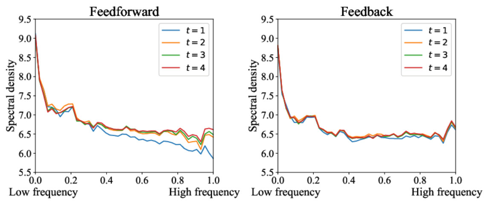
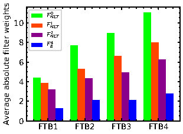
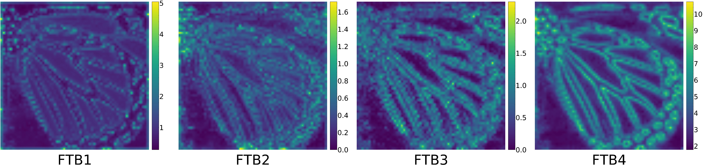

# All-super-resolution-models
## A generic super-resolution framework which implements the following networks
* IMDN 
* LatticeNet
* IDN
* CARN
* DRCN
* EDSR
* DRRN
* LapSRN
* VDSR
* Updating...

## Implement some useful functions for article figures. Like the following:

* **1. generate\_best**: Automatically compare your method with other methods and visualize the best patches.

* **2. Frequency\_analysis**: Convert an image to 1-D spectral densities.

* **3. relation**: Explore relations in fuse stage.(eg. torch.cat([t1, t2, t3, c4], dim=1) and then fuse them with 1x1 convolution)

* **4. feature\_map**: Visualize feature map.(average feature maps along channel axis)

