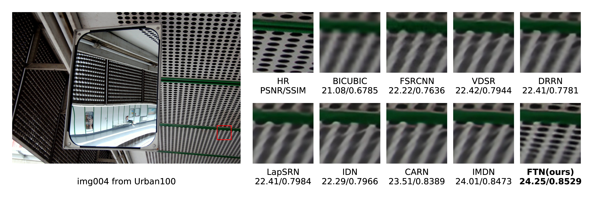

**About article utils**

This directory contains some helpful functions which prodeuce figures needed in article.
* generate\_best: Compare your method with other methods and visualize the best patches. The img dirs should be organized like:
    * HR:
        - {your_img_name}.jpg
        - ...
    * BICUBIC:
        - {your_img_name}.jpg
        - ...
    * ...

* Frequency\_analysis: Convert an image to 1-D spectral densities.

* relation: Explore relations in fuse stage.(eg. torch.cat([t1, t2, t3, c4], dim=1) and then fuse them with 1x1 convolution)

* feature\_map: Visualize feature map.(average feature maps along channel axis)

